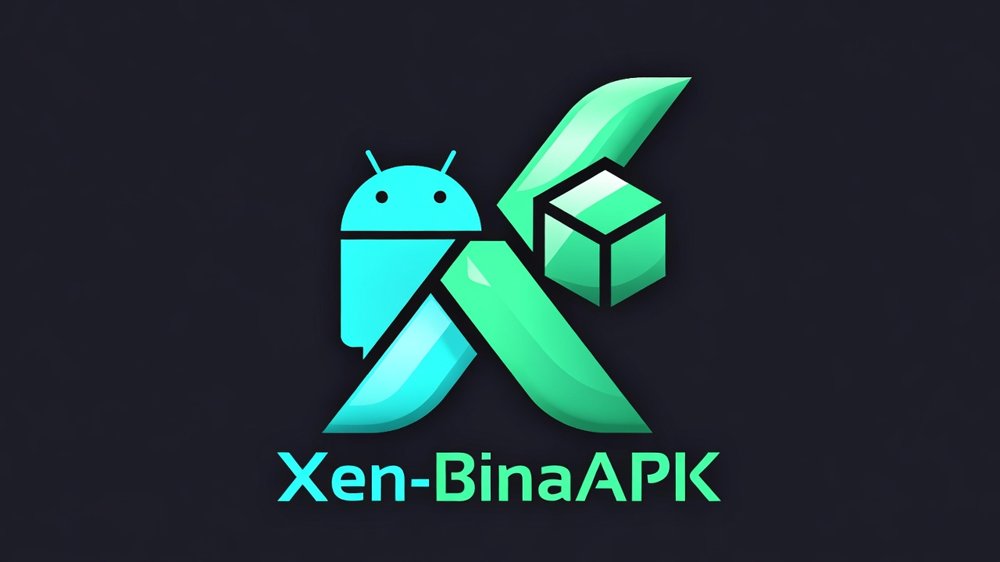

  

# BinaAPK 

Selamat datang ke **BinaAPK**, platform mudah untuk menukarkan aplikasi web HTML/JS/CSS anda kepada fail pemasangan Android (.apk) secara automatik!

Kini lebih berkuasa dengan sokongan **Muat Naik Folder Terus** dan **Drag & Drop**! Anda tidak perlu lagi menolak (push) kod anda ke repository secara manual sebelum membina.

## Ciri-ciri Baharu
- 📂 **Muat Naik Folder**: Pilih folder projek anda terus menerus.
- 🖐️ **Drag & Drop**: Seret folder projek atau ikon aplikasi terus ke dalam borang.
- ⚡ **Pantas & Mudah**: Integrasi terus ke GitHub Actions tanpa konfigurasi rumit.
- 🌐 **Sokongan Multi-Platform**: Berfungsi lancar di Vercel dan Netlify.

## Cara Menggunakan BinaAPK

### Langkah 1: Sediakan Repository Sasaran
Sistem ini akan menghantar hasil binaan (.apk) ke repository GitHub pilihan anda. Pastikan anda mempunyai sebuan repository (kosong pun boleh) di GitHub.

### Langkah 2: Dapatkan GitHub Access Token Anda
Sistem BinaAPK memerlukan kebenaran untuk memuat naik fail APK yang telah siap ke repository anda.
1. Log masuk ke akaun GitHub anda.
2. Pergi ke **Settings** > **Developer settings** > **Personal access tokens** > **Tokens (classic)**.
   *(Atau klik pautan pantas ini: [Semat Token Baru](https://github.com/settings/tokens/new))*
3. Letakkan nama (cth: `BinaAPK`).
4. Pilih scopes: `repo` & `workflow`.
5. **Salin token tersebut (ghp_...).**

### Langkah 3: Mula Membina APK!
1. Buka laman web BinaAPK.
2. **Target Repository**: Masukkan format `username/repo` sasaran anda.
3. **Folder Assets Web**: 
   - Klik butang untuk pilih folder projek anda.
   - ATAU **Seret & Lepas** folder projek anda terus ke dalam kotak yang disediakan.
4. **Ikon Aplikasi**: 
   - Pilih fail PNG ikon anda.
   - ATAU **Seret & Lepas** fail ikon ke bahagian ikon.
5. Klik **Mulakan Proses Bina APK**.

## Tempoh Menunggu & Memuat Turun
Proses pembinaan APK akan mengambil masa sekitar **2 hingga 4 minit**. Anda boleh menyemak perkembangannya di tab **Actions** pada repository GitHub anda.

Setelah siap, fail APK anda akan berada di bahagian **Releases** di repository GitHub anda!
